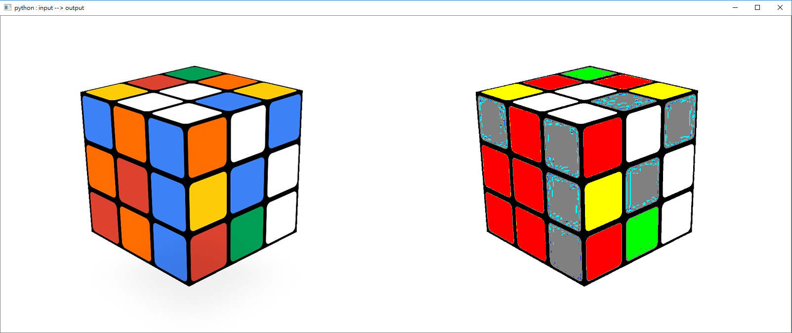

## opencv 傳 python numpy , c/c++ cv::Mat 交互 

- python 執行概念如下 :

  ```python
  """========================================================================
  動機: 
  由於 python 雖在 AI 模型上(pytorch/tensorflow) 很方便，但在 render 或是客製化影像預處理函式(改圖片的每個 pixel) 效能極慢 (for-loop) , 但 C/C++ 方面即快，固可使用 python ctypes 串接 (python call C/C++) 整合專案 !! 
  
  ==========================================================================="""
  
  # 初始化 ColorMap 物件，會從 XXX.dll (windows), XXX.so (linux/mac) 讀取C/C++編譯好的函式庫
  colormap = ColorMap()
  
  # 從 python opencv 讀一張圖片 numpy , uint8(H,W,3(BGR))
  img = cv2.imread("XXX.jpg")
  # python  numpy ---> ctypes pointer (1維) ---> c/c++,cv::Mat ---->  ctypes pointer (1維) ---> python numpy 
  rimg = colormap.run(img)
  
  
  ```


- C/C++ ColorMap 物件  (詳見 colormap.cpp)

  ```c++
  /*========================================================
  	ColorMap::assign() 範例是把圖片每格 pixel BGR 轉換成最近(L1-norm)		的 9 種顏色 ({0,255} x {0,255} x {0,255}) , (128,128,128)*/
  
  // c++ 部分
  std::vector<cv::Vec3i> ColorMapColors; // 儲存9種顏色的全局變數，(成員變數會有 bug!!)
  class ColorMap{
      public:
      	void assign(cv::Mat img);
  }
  
  /* 
  	跟 python ctypes 串接的 c-pointer 部分
  	如果是 windows 系統需要在 extern"C" 每個方法裡前加 __declspec(dllexport)
  */
  extern "C"{
      //建構 ColorMap 物件 
  	ColorMap* ColorMapNew();  
      // colormap 方法 
      unsigned char* ColorMapAssign(ColorMap *cm,unsigned char* ptr,int H,int W);
      //釋放 pointer 
      void release(unsigned char* data) 
  }
  
  ```

  C/C++ 編譯成 .dll , .so  ,  cmd 指令 !!

  此範例是使用 [intel-openvino](https://software.intel.com/en-us/openvino-toolkit) 裡面的 opencv 函式庫，若不使用 openvino 裡的 opencv 函式庫，路徑鏈結需自行修改 !!


  - windows (microsoft visual c++)  

    ```bash
    # cmd 上，初始化 microsoft visual c++ (x86_64) 編譯環境 ( cl.exe ): "C:\Program Files (x86)\Microsoft Visual Studio 14.0\VC\bin\x86_amd64\vcvarsx86_amd64.bat"
    msvc --init-cl
    msvc --compile   # (語法詳見 msvc.bat)
    ```

  - linux/mac (g++/clang) 

    ```shell
    # 編譯指令，會使用 g++ 編譯器 (詳見 setup.py)
    python3 setup.py build
    ```


- Python ColorMap 物件虛擬碼  (詳見 main.py)

  ```python
  import numpy as np
  import ctypes 
  
  class ColorMap:
  	def __init__(self):
          # 讀取 XXX.dll
          self.cxx = ctypes.cdll.LoadLibrary("XXX.dll")
          #  對照到 ColorMapNew() 宣告物件 !!
  		self.colormap_model = self.cxx.ColorMapNew()
  		#  ColorMapAssign() 宣告輸出 pointer 型別
  		self.cxx.ColorMapAssign.restype = ctypes.POINTER(ctypes.c_uint8)
     	
      def run(self,img):
  		h = img.shape[0]
  		w = img.shape[1]
          #====================================================================
  		rptr= self.cxx.ColorMapAssign(
              self.colormap_model,
              img.astype(np.uint8).ctypes.data_as(ctypes.c_char_p), # 轉換成 pointer
              h,
              w
          )
          #=====================================================================
          # 轉回成 numpy 格式 !!
  		r1dimg = np.ctypeslib.as_array(rptr,(h*w*3,)).copy()
  		# 釋放記憶體
          self.cxx.release(rptr)
          # 重新調整 numpy 形狀到 (h,w,3)
  		rimg = r1dimg.reshape((h,w,3))
  		return rimg
  		
  ```

### 執行 ColorMap 範例 cube.jpg 結果




